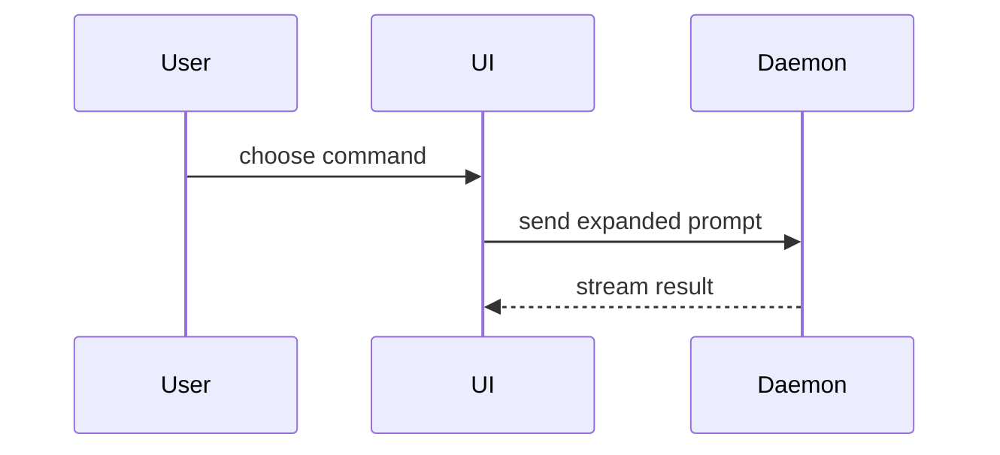

# Show Me

Help the user understand the current topic visually. Skip the preamble. Pick the smallest view that makes the key relationship clear, then place a brief textual conclusion next to it.

The visual is a presentation layer. It does not replace the authority of requirements, specifications, plans, tickets, source code, evidence, approvals, or verdicts. Preserve their labels, status, uncertainty, ordering, and ownership. Surface contradictions instead of resolving them in the visual.

## Choose the View

Show logic or an algorithm as pseudocode:

```text
on(save)
  if content is unchanged
    return cached result
  write new content
  return fresh result
```

Show runtime control flow as a call tree:

```text
submitForm
  createSession
    persistPrompt
    launchAgent
  navigateToSession
```

Show UI structure as a component tree, including only state and module boundaries that matter:

```tsx
<SessionPage> (apps/example/src/routes/session.tsx)
  useSessionEvents()
  <SessionToolbar>
    <RunSkillButton> (packages/ui)
```

Show file responsibility or a broad refactor as a shallow file tree:

```text
src/
├── commands/       # parses user actions
├── sessions/       # owns session state
└── transport/      # sends API requests
```

Show component interaction, control flow, or data flow with Mermaid:



Use `diff` when the point is what changes and the surrounding shape already exists. Match the diff shape to the topic:

```diff
 submitForm
   createSession
     persistPrompt
+    expandSkillMention
     launchAgent
-  navigateToSession
+  navigateToSession
+    subscribeToEvents
```

Show the whole block when most of it is new, omitted context would hide ownership or order, or the user needs a copyable target shape:

```ts
function expandSkill(command: string): string {
  const skillName = command.slice(1)
  return `use the ${skillName} skill`
}
```

Use one view when it is sufficient. Combine views only when each answers a distinct part of the question.

## HTML Artifacts

Create one focused HTML diagram, infographic, or short slide deck only when the user has explicit artifact intent and the environment supports both creating the file and presenting it through an available opener. Match the product's colors, type, spacing, and components; use real labels and data; support desktop and mobile. When either condition is absent, render the smallest inline text, diff, code, or Mermaid view instead.

## Completion

Place each visual next to its textual conclusion. Keep only the calls, files, props, states, mappings, and boundaries needed for the current question. Completion requires that the conclusion remains traceable to the authoritative source and the visual introduces no new decision, evidence, approval, or certainty.
